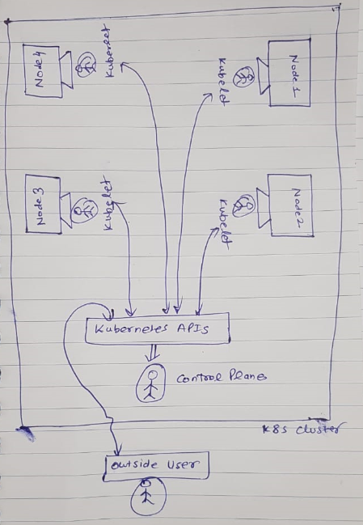
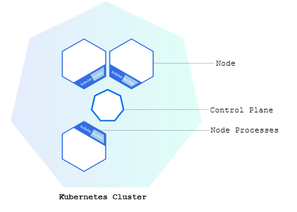
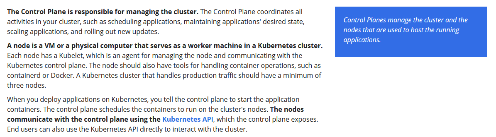
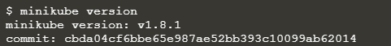
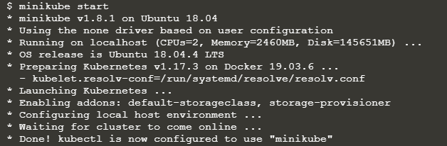
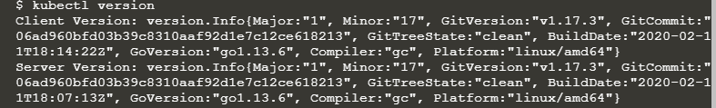
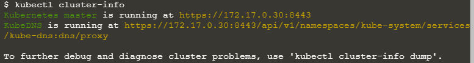
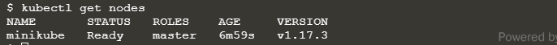

# kubernetes-faqs

##### References
- https://kubernetes.io/docs/tutorials/kubernetes-basics/create-cluster/cluster-intro/

##### Why to use Kubernetes?
With modern web services, users expect applications to be available 24/7, and developers expect to deploy new versions of those applications several times a day. Containerization helps package software to serve these goals, enabling applications to be released and updated without downtime. Kubernetes helps you make sure those containerized applications run where and when you want, and helps them find the resources and tools they need to work. Kubernetes is a production-ready, open source platform designed with Google's accumulated experience in container orchestration, combined with best-of-breed ideas from the community.

##### What is the context of Kubernetes cluster?

- Kubernetes coordinates a highly available cluster of computers that are connected to work as a single unit.
- The abstractions in Kubernetes allow you to deploy containerized applications to a cluster without tying them specifically to individual machines.
- This abstraction is good in the sense that containerized app need not to worry which machine is in healthy state for deployment. Application will just say that deploy this app in Kubernetes cluster and then it is cluster's job to figure it out which machine can be used for deployment.
- Kubernetes automates the distribution and scheduling of application containers across a cluster in a more efficient way.
- Kubernetes is an open-source platform and is production-ready.

##### What is the pre-condition for applications so that they can be deployed in Kubernetes cluster?

- applications need to be packaged in a way that decouples them from individual hosts: they need to be containerized.

##### What was traditional approach to deploy applications in web containers like Tomcat etc.?
- applications were installed directly onto specific machines as packages deeply integrated into the host.

##### Explain kubernetes cluster via pictures.

##### what is minikube?

Refer link - https://minikube.sigs.k8s.io/docs/start/
- minikube is local Kubernetes, focusing on making it easy to learn and develop for Kubernetes.

##### which are the various commands we ran during this exercise?

- **minikube version**
    - after installing minikube, this command will display installed minikube version.
    

    
- **minikube start**
    - it will set up one node kubernetes cluster

- **kubectl version**
    - after installing kubectl, this command will display both kubernetes client and server versions

- **kubectl cluster-info**
    - this command will display cluster details.
    
- **kubectl get nodes**
    - This command shows all nodes that can be used to host our applications. Now we have only one node, and we can see that its status is ready (it is ready to accept applications for deployment).

