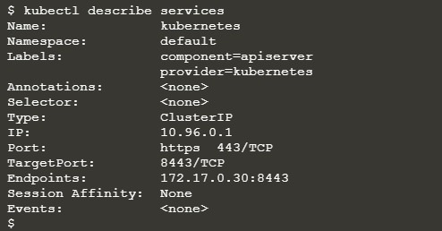
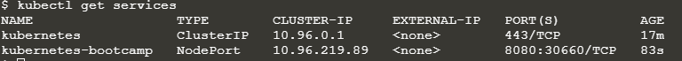

# kubernetes-faqs

##### References
- https://kubernetes.io/docs/tutorials/kubernetes-basics/create-cluster/cluster-intro/

##### Why to use Kubernetes?
With modern web services, users expect applications to be available 24/7, and developers expect to deploy new versions of those applications several times a day. Containerization helps package software to serve these goals, enabling applications to be released and updated without downtime. Kubernetes helps you make sure those containerized applications run where and when you want, and helps them find the resources and tools they need to work. Kubernetes is a production-ready, open source platform designed with Google's accumulated experience in container orchestration, combined with best-of-breed ideas from the community.

##### What is the context of Kubernetes cluster?

- Kubernetes coordinates a highly available cluster of computers that are connected to work as a single unit.
- The abstractions in Kubernetes allow you to deploy containerized applications to a cluster without tying them specifically to individual machines.
- This abstraction is good in the sense that containerized app need not to worry which machine is in healthy state for deployment. Application will just say that deploy this app in Kubernetes cluster and then it is cluster's job to figure it out which machine can be used for deployment.
- Kubernetes automates the distribution and scheduling of application containers across a cluster in a more efficient way.
- Kubernetes is an open-source platform and is production-ready.

##### What is the pre-condition for applications so that they can be deployed in Kubernetes cluster?

- applications need to be packaged in a way that decouples them from individual hosts: they need to be containerized.

##### What was traditional approach to deploy applications in web containers like Tomcat etc.?
- applications were installed directly onto specific machines as packages deeply integrated into the host.

##### Explain kubernetes cluster via pictures.

##### what is minikube?

Refer link - https://minikube.sigs.k8s.io/docs/start/
- minikube is local Kubernetes, focusing on making it easy to learn and develop for Kubernetes.

##### which are the various commands we ran during this exercise?

- **minikube version**
    - after installing minikube, this command will display installed minikube version.
    

    
- **minikube start**
    - it will set up one node kubernetes cluster

- **kubectl version**
    - after installing kubectl, this command will display both kubernetes client and server versions
    

- **kubectl cluster-info**
    - this command will display cluster details.
    
    

- **kubectl get nodes**
    - This command shows all nodes that can be used to host our applications. Now we have only one node, and we can see that its status is ready (it is ready to accept applications for deployment).
    

- **kubectl get deployments**
    - This command will tell how many instances of an application are running in kubernetes cluster.

- **kubectl get services**

- Overall, you can type `kubectl --help` and it will display what all options can be provided in CLI. 
- Normally, syntax is usually `kubectl action resource`

##### What is the context of deploying application in Kubernetes cluster?

- Once you have a running Kubernetes cluster, you can deploy your containerized applications on top of it.

##### What is the context of kubernetes deployment configuration?

- create a Kubernetes Deployment configuration. The Deployment instructs Kubernetes how to create and update instances of your application.

- Once you've created a Deployment, the Kubernetes control plane schedules the application instances included in that Deployment to run on individual Nodes in the cluster

##### Who will take care if node running the application goes down?

Once the application instances are created, a Kubernetes Deployment Controller continuously monitors those instances. If the Node hosting an instance goes down or is deleted, the Deployment controller replaces the instance with an instance on another Node in the cluster. This provides a self-healing mechanism to address machine failure or maintenance.

##### What was traditional approach and constraint with it?

In a pre-orchestration world, installation scripts would often be used to start applications, but they did not allow recovery from machine failure. By both creating your application instances and keeping them running across Nodes, Kubernetes Deployments provide a fundamentally different approach to application management.

##### what is kubectl?

kubectl is command line interface which talks to Kubernetes cluster via Kubernetes APIs.

##### how to check if kubectl is configured properly to talk to Kubernetes cluster?

Just type `kubectl version` command.If it displays both client and server version then it is configured properly. 

##### Give an example of deploying application in kubernetes cluster?

- `kubectl create deployment` command can be used to deploy an app in kubernetes cluster.
- `kubectl create deployment kubernetes-bootcamp --image=gcr.io/google-samples/kubernetes-bootcamp:v1`
- When we create a Deployment on Kubernetes, that Deployment creates Pods with containers inside them (as opposed to creating containers directly). 
  

We need to provide the deployment name and app image location (include the full repository url for images hosted outside Docker hub).

##### What kubernetes will do when kubectl requests for deploying an application in kubernetes cluster.

##### what will be output when we type command `kubectl get pods` after starting `minikube` and configuring `kubectl`?
No resources found in default namespace

##### what will be output when we type command `kubectl get deployments` after starting `minikube` and configuring `kubectl`?
No resources found in default namespace

##### What is the context of pods in kubernetes cluster?

- A Pod is the basic execution unit of a Kubernetes application.
- Each Pod represents a part of a workload that is running on your cluster
- Pods that are running inside Kubernetes are running on a private, isolated network.
- By default, pods are visible from other pods and services within the same kubernetes cluster, but not outside that network.
-  When we use kubectl, we're interacting through an API endpoint to communicate with our application.
- Pod is used to host your application instance.
- A Pod models an application-specific "logical host" and can contain different application containers which are relatively tightly coupled. 
  For example, a Pod might include both the container with your Node.js app as well as a different container that feeds the data to be published 
  by the Node.js webserver. The containers in a Pod share an IP Address and port space, are always co-located and co-scheduled, and run in a shared 
  context on the same Node.
- Pods are the atomic unit on the Kubernetes platform.
- Each Pod is tied to the Node where it is scheduled, and remains there until termination (according to restart policy) or deletion. 
  In case of a Node failure, identical Pods are scheduled on other available Nodes in the cluster.
  
  
  
  

##### How to talk to pod (running an application) from outside kubernetes cluster without exposing application running inside that pod?

- The kubectl command can create a proxy via following command which will forward communications into the cluster-wide, private network.

    `kubectl proxy` ==> 
    
    We now have a connection between our host (the online terminal) and the Kubernetes cluster. The proxy enables direct access to the API from these terminals.

- The proxy can be terminated by pressing control-C and won't show any output while its running.

-  The API server will automatically create an endpoint for each pod, based on the pod name, that is also accessible through the proxy.

##### What is the context of Nodes in kubernetes cluster?

Following command can tell more details around node:

##### Which troubleshooting commands can be used w.r.t. kubectl?

For example - describe command displays extensive details for a resource which in this case is Pod. 

##### what could be problems when Pods die?

##### why to use service in Kubernetes cluster?
- Although each Pod has a unique IP address, those IPs are not exposed outside the cluster without a Service.
- Services allow your applications to receive traffic
- Services enable a loose coupling between dependent Pods.

##### is there any default service which gets created when we start kubernetes cluster via minikube start?4
Following service gets created by default:

##### Does minikube supports LoadBalancer option yet?
No

##### How to expose pods (i.e. applications) to outside world by using services?
by creating new service

##### Which commands/steps can be used to create a new service?
- To create a new service and expose it to external traffic, use the expose command with NodePort as parameter.
`kubectl expose deployment/kubernetes-bootcamp --type="NodePort" --port 8080`

##### How to export/save a variable to use that variable later? Please give an example:

`export NODE_PORT=$(kubectl get services/kubernetes-bootcamp -o go-template='{{(index .spec.ports 0).nodePort}}')`

`echo NODE_PORT=$NODE_PORT`

