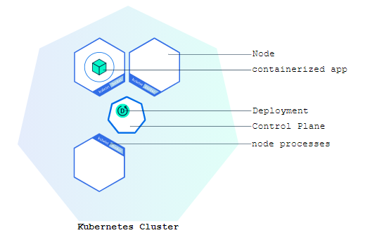
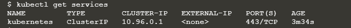

# kubernetes-faqs

##### References
- https://kubernetes.io/docs/tutorials/kubernetes-basics/create-cluster/cluster-intro/
- https://kubernetes.io/docs/concepts/overview/components/
- https://kubernetes.io/docs/reference/kubernetes-api/workload-resources/pod-v1/#PodSpec


##### Why to use Kubernetes?
With modern web services, users expect applications to be available 24/7, and developers expect to deploy new versions of those applications several times a day. Containerization helps package software to serve these goals, enabling applications to be released and updated without downtime. Kubernetes helps you make sure those containerized applications run where and when you want, and helps them find the resources and tools they need to work. Kubernetes is a production-ready, open source platform designed with Google's accumulated experience in container orchestration, combined with best-of-breed ideas from the community.

##### What is the context of Kubernetes cluster?

- Kubernetes coordinates a highly available cluster of computers that are connected to work as a single unit.
- The abstractions in Kubernetes allow you to deploy containerized applications to a cluster without tying them specifically to individual machines.
- This abstraction is good in the sense that containerized app need not to worry which machine is in healthy state for deployment. Application will just say that deploy this app in Kubernetes cluster and then it is cluster's job to figure it out which machine can be used for deployment.
- Kubernetes automates the distribution and scheduling of application containers across a cluster in a more efficient way.
- Kubernetes is an open-source platform and is production-ready.

##### What is the pre-condition for applications so that they can be deployed in Kubernetes cluster?

- applications need to be packaged in a way that decouples them from individual hosts: they need to be containerized.

##### What was traditional approach to deploy applications in web containers like Tomcat etc.?
- applications were installed directly onto specific machines as packages deeply integrated into the host.

##### Explain kubernetes cluster via pictures.


- When you deploy Kubernetes, you get a cluster.
- Every cluster has at least one worker node.
- A Kubernetes cluster consists of a set of worker machines, called nodes, that run containerized applications. 
- The worker node(s) host the Pods that are the components of the application workload.
-  The control plane manages the worker nodes and the Pods in the cluster.

##### what is special about cluster configuration in production environment?
In production environments, the control plane usually runs across multiple computers and a cluster usually runs multiple nodes, providing fault-tolerance and high availability.

##### Control plane components are responsible primarily for which job?


##### API server is responsible primarily for which job?
- exposes the Kubernetes API
- The API server is the front end for the Kubernetes control plane.
- The main implementation of a Kubernetes API server is kube-apiserver
- kube-apiserver is designed to scale horizontally. that is, it scales by deploying more instances. 
- You can run several instances of kube-apiserver and balance traffic between those instances.

##### etcd is responsible primarily for which job?
- Consistent and highly-available key value store used as Kubernetes' backing store for all cluster data.
- If your Kubernetes cluster uses etcd as its backing store, make sure you have a back up plan for those data.

##### kube-scheduler is responsible primarily for which job?
- watches for newly created Pods with no assigned node, and selects a node for them to run on.
- Factors taken into account for scheduling decisions include: individual and collective resource requirements, hardware/software/policy constraints, affinity and anti-affinity specifications, data locality, inter-workload interference, and deadlines

##### kube-controller-manager is responsible primarily for which job?


##### kubelet is responsible primarily for which job?


##### kube-proxy is responsible primarily for which job?


##### Web UI dashboard is responsible primarily for which job?


##### Container Resource Monitoring is responsible primarily for which job?
Container Resource Monitoring records generic time-series metrics about containers in a central database, and provides a UI for browsing that data.

##### Cluster-level Logging is responsible primarily for which job?
A cluster-level logging mechanism is responsible for saving container logs to a central log store with search/browsing interface.

##### what is minikube?
Refer link - https://minikube.sigs.k8s.io/docs/start/
- minikube is local Kubernetes, focusing on making it easy to learn and develop for Kubernetes.

##### Which are the key points common for all kubernetes objects?
- persistent entities in the Kubernetes system.
- represent the state of your cluster
- once you create the object, the Kubernetes system will constantly work to ensure that object exists.
- To work with Kubernetes objects--whether to create, modify, or delete them--you'll need to use the Kubernetes API.
- When you use the kubectl command-line interface, for example, the CLI makes the necessary Kubernetes API calls for you.
- You can also use the Kubernetes API directly in your own programs using one of the Client Libraries.
- When you use the Kubernetes API to create the object (either directly or via kubectl), that API request must 
include that information as JSON in the request body. Most often, you provide the information to kubectl in a 
.yaml file. kubectl converts the information to JSON when making the API request.

##### which are the various commands we ran during this exercise?

- **minikube version**
    - after installing minikube, this command will display installed minikube version.
    

    
- **minikube start**
    - it will set up one node kubernetes cluster


- **kubectl version**
    - after installing kubectl, this command will display both kubernetes client and server versions
    


- **kubectl cluster-info**
    - this command will display cluster details.
    
    

- **kubectl get nodes**
    - This command shows all nodes that can be used to host our applications. Now we have only one node, and we can see that its status is ready (it is ready to accept applications for deployment).
    


- **kubectl get deployments**
    - This command will tell how many instances of an application are running in kubernetes cluster.

- **kubectl get services**

- Overall, you can type `kubectl --help` and it will display what all options can be provided in CLI. 
- Normally, syntax is usually `kubectl action resource`


##### What is the context of deploying application in Kubernetes cluster?

- Once you have a running Kubernetes cluster, you can deploy your containerized applications on top of it.

##### What is the context of kubernetes deployment configuration?

- create a Kubernetes Deployment configuration. The Deployment instructs Kubernetes how to create and update instances of your application.

- Once you've created a Deployment, the Kubernetes control plane schedules the application instances included in that Deployment to run on individual Nodes in the cluster



##### Who will take care if node running the application goes down?

Once the application instances are created, a Kubernetes Deployment Controller continuously monitors those instances. If the Node hosting an instance goes down or is deleted, the Deployment controller replaces the instance with an instance on another Node in the cluster. This provides a self-healing mechanism to address machine failure or maintenance.

##### What was traditional approach and constraint with it?

In a pre-orchestration world, installation scripts would often be used to start applications, but they did not allow recovery from machine failure. By both creating your application instances and keeping them running across Nodes, Kubernetes Deployments provide a fundamentally different approach to application management.

##### what is kubectl?

kubectl is command line interface which talks to Kubernetes cluster via Kubernetes APIs.

##### how to check if kubectl is configured properly to talk to Kubernetes cluster?

Just type `kubectl version` command.If it displays both client and server version then it is configured properly. 

##### Give an example of deploying application in kubernetes cluster?

- `kubectl create deployment` command can be used to deploy an app in kubernetes cluster.
- `kubectl create deployment kubernetes-bootcamp --image=gcr.io/google-samples/kubernetes-bootcamp:v1`
- When we create a Deployment on Kubernetes, that Deployment creates Pods with containers inside them (as opposed to creating containers directly). 
  

We need to provide the deployment name and app image location (include the full repository url for images hosted outside Docker hub).

##### What kubernetes will do when kubectl requests for deploying an application in kubernetes cluster.


##### what will be output when we type command `kubectl get pods` after starting `minikube` and configuring `kubectl`?
No resources found in default namespace

##### what will be output when we type command `kubectl get deployments` after starting `minikube` and configuring `kubectl`?
No resources found in default namespace

##### What is the context of pods in kubernetes cluster?

- A Pod is the basic execution unit of a Kubernetes application.
- Each Pod represents a part of a workload that is running on your cluster
- Pods that are running inside Kubernetes are running on a private, isolated network.
- By default, pods are visible from other pods and services within the same kubernetes cluster, but not outside that network.
-  When we use kubectl, we're interacting through an API endpoint to communicate with our application.
- Pod is used to host your application instance.
- A Pod models an application-specific "logical host" and can contain different application containers which are relatively tightly coupled. 
  For example, a Pod might include both the container with your Node.js app as well as a different container that feeds the data to be published 
  by the Node.js webserver. The containers in a Pod share an IP Address and port space, are always co-located and co-scheduled, and run in a shared 
  context on the same Node.
- Pods are the atomic unit on the Kubernetes platform.
- Each Pod is tied to the Node where it is scheduled, and remains there until termination (according to restart policy) or deletion. 
  In case of a Node failure, identical Pods are scheduled on other available Nodes in the cluster.
  
  
  
  

##### How to talk to pod (running an application) from outside kubernetes cluster without exposing application running inside that pod?

- The kubectl command can create a proxy via following command which will forward communications into the cluster-wide, private network.

    `kubectl proxy` ==> 
    
    We now have a connection between our host (the online terminal) and the Kubernetes cluster. The proxy enables direct access to the API from these terminals.

- The proxy can be terminated by pressing control-C and won't show any output while its running.

- The API server will automatically create an endpoint for each pod, based on the pod name, that is also accessible through the proxy.

- Once we create proxy then just get name of the pod which you want to access and curl api endpoint as follows:

  `export POD_NAME=$(kubectl get pods -o go-template --template '{{range .items}}{{.metadata.name}}{{"\n"}}{{end}}')`
  
  `echo Name of the Pod: $POD_NAME`
  
  `curl http://<kube proxy server>:<kube proxy port>/api/v1/namespaces/default/pods/$POD_NAME/proxy/`
  
  
##### What is the context of Nodes in kubernetes cluster?


Following command can tell more details around node:


##### Which troubleshooting commands can be used w.r.t. kubectl?


For example - describe command displays extensive details for a resource which in this case is Pod. 


##### How to export/save a variable to use that variable later? Please give an example:

`export NODE_PORT=$(kubectl get services/kubernetes-bootcamp -o go-template='{{(index .spec.ports 0).nodePort}}')`

`echo NODE_PORT=$NODE_PORT`

##### How to view container logs running inside pod?


##### Give an example of executing command inside container running in pod.

- Let’s list the environment variables:


- start a bash session in the Pod’s container:


- run more commands in the Pod’s container:


##### what could be problems when Pods die?


##### why to use service in Kubernetes cluster?
- Although each Pod has a unique IP address, those IPs are not exposed outside the cluster without a Service.
- Services allow your applications to receive traffic
- Services enable a loose coupling between dependent Pods.
- A Service routes traffic across a set of Pods.
- Service allow pods to die and replicate in Kubernetes without impacting your application. 
- Discovery and routing among dependent Pods (such as the frontend and backend components in an application) is handled by Kubernetes Services.
- Services match a set of Pods using labels and selectors


##### is there any default service which gets created when we start kubernetes cluster via minikube start?
Following service gets created by default:



##### Does minikube supports LoadBalancer option yet?
No

##### How to expose pods (i.e. applications) to outside world by using services?
by creating new service

##### Which commands/steps can be used to create a new service?
- To create a new service and expose it to external traffic, use the expose command with NodePort as parameter.

`kubectl expose deployment/kubernetes-bootcamp --type="NodePort" --port 8080`


##### List down sequence of steps to better understand connection between deployment -> pod -> Node -> service -> cluster


##### What is the context of using labels in kubernetes objects?
- Labels are key/value pairs attached to objects and can be used in any number of ways.
- can be used to designate objects for development, test, and production
- can be used to embed version tags
- can be used to classify an object using tags

##### When labels can be created for kubernetes objects?
Labels can be attached to objects at creation time or later on. They can be modified at any time.

##### Give an example of how to view and apply labels to kubernetes objects.


- The Deployment created automatically a label for our Pod.
- get list of pods attached with above label by following command

```
kubectl describe deployment
kubectl get pods -l run=kubernetes-bootcamp
kubectl get services -l run=kubernetes-bootcamp
export POD_NAME=$(kubectl get pods -o go-template --template '{{range .items}}{{.metadata.name}}{{"\n"}}{{end}}')
echo Name of the Pod: $POD_NAME
kubectl label pod $POD_NAME app=v1
kubectl describe pods $POD_NAME
kubectl get pods -l app=v1
```


##### Is there a way to delete Kubernetes service. If yes then how?

```
kubectl delete service -l run=kubernetes-bootcamp
kubectl get services
curl $(minikube ip):$NODE_PORT
kubectl exec -ti $POD_NAME curl localhost:8080
```

##### What does it mean when kubernetes service is deleted?
Application will not be reachable anymore from outside of the cluster.

##### Is it that when a service is deleted then application will go down?
No, it only means that application will not be reachable outside kubernetes cluster.

##### what is the way to shut down application?
To shut down the application, you would need to delete the Deployment as well.

##### what is the context of scaling an application?
so far
- we created a Deployment, and then exposed it publicly via a Service. 
- The Deployment created only one Pod for running our application. 
- When traffic increases, we will need to scale the application to keep up with user demand.

##### what is the way to scale an application?
- Scaling is accomplished by changing the number of replicas in a Deployment.
- Scaling out a Deployment will ensure new Pods are created and scheduled to Nodes with available resources. Scaling will increase the number of Pods to the new desired state.
- Scaling to zero is also possible, and it will terminate all Pods of the specified Deployment.

#### Does kubernetes support autoscaling of pods?
Yes, Kubernetes also supports autoscaling of Pods.

#### How traffic will be routed if multiple instances of same pod are running?
- Running multiple instances of an application will require a way to distribute the traffic to 
all of them. Services have an integrated load-balancer that will distribute network traffic 
to all Pods of an exposed Deployment. Services will monitor continuously the running Pods 
using endpoints, to ensure the traffic is sent only to available Pods.

- Once you have multiple instances of an Application running, you would be able to do 
Rolling updates without downtime.

#### Please explain in detail what all attributes meaning is in `kubectl get deployments` command.


##### How to check replica set created by create deployment step?


##### How to scale application instances?
```
kubectl get deployments
kubectl get rs
kubectl scale deployments/kubernetes-bootcamp --replicas=4
kubectl get deployments
kubectl get pods -o wide
kubectl describe deployments/kubernetes-bootcamp
```

In similar fashion, application instances can be scaled down.


##### What is the concept of rolling updates?


##### What is the benefit of performing rolling updates?


##### How to update docker image version?
- use the set image command, followed by the deployment name and the new image version:
```
kubectl set image deployments/kubernetes-bootcamp kubernetes-bootcamp=jocatalin/kubernetes-bootcamp:v2
```

- The update can be confirmed also by running a rollout status command
```
kubectl rollout status deployments/kubernetes-bootcamp
```

##### Which command can be used to roll back to previous version?
```
kubectl rollout undo deployments/kubernetes-bootcamp
```

##### How to set up minikube on Google cloud platform?
- install docker
- install minikube (link - https://minikube.sigs.k8s.io/docs/start/ and https://minikube.sigs.k8s.io/docs/drivers/)
- install kubectl 
- after installing minikube and kubectl, verify by using commands `minikube version` and `kubectl`

##### Please give an example of deploying simple sprint boot app (i.e. with one endpoint /hello) in kubernetes cluster.
- Using spring initializer, build spring boot app
- Expose one endpoint with url, for example - /hello which returns "hello, anshul"
- build this app using maven so that in target folder, application jar file gets generated
- create Dockerfile with above jar 
- build docker image
- test this docker image if end point is working correctly
- push this image in docker hub
- check if pod is running
- create kubernetes deployment
- expose kubernetes service
- access application url via kubernetes cluster ip and node port


##### what will happen if image referred in `create deployment` step is not present in docker hub or unable to pull image from docker hub?
Pod will not come up. It could be checked by `kubectl get pods` command where current state and desired state will not match.
Also status will be pending.


##### what is the way to tell kubernetes cluster to always download image from local machine where kubernetes cluster is running?

Overall
- use docker daemon of minikube
- build image using above docker daemon
- set imagepullpolicy to never
- create deployment

##### Give an example of creating deployment via yaml file.


```
kubectl apply -f https://k8s.io/examples/application/deployment.yaml --record
```


##### What is object name all about?
- Each object in your cluster has a Name that is unique for that type of resource within same namespace.
- For example, you can only have one Pod named myapp-1234 within the same namespace, but you can have one Pod 
and one Deployment that are each named myapp-1234.

##### What is object UUID all about?
- A Kubernetes systems-generated string to uniquely identify objects.
- Kubernetes UIDs are universally unique identifiers (also known as UUIDs). 

##### When to use multiple namespace?


##### which command can be used to view all namespaces?
```
kubectl get namespace
```
- Avoid creating namespace with prefix kube-, since it is reserved for Kubernetes system namespaces.

##### Is there a way to set specific namespace in kubernetes configuration and then all subsequent commands run in same namespace?


##### How to set namespace while doing CRUD for kubernetes objects?
Using --namespace flag in request

##### Is it that all kubernetes objects are in namespace?

```
# In a namespace
kubectl api-resources --namespaced=true

# Not in a namespace
kubectl api-resources --namespaced=false
```

##### what is special about labels and when it should be used?
- Labels are key/value pairs that are attached to objects, such as pods.
- Labels are intended to be used to specify identifying attributes of objects that are meaningful and relevant to users, 
but do not directly imply semantics to the core system.
- Labels can be attached to objects at creation time and subsequently added and modified at any time.
- Labels allow for efficient queries and watches and are ideal for use in UIs and CLIs. 
- Non-identifying information should be recorded using annotations.


##### Give some examples of using labels.


##### when to use annotations vs label while creating objects in kubernetes?
- You can use Kubernetes annotations to attach arbitrary non-identifying metadata to objects.
- Clients such as tools and libraries can retrieve this metadata.
- Labels can be used to select objects and to find collections of objects that satisfy certain conditions. 
- In contrast, annotations are not used to identify and select objects.


##### Give some examples of using annotations.


##### which are the key points regarding containers?
- A container image is a ready-to-run software package, containing everything needed to run an application: 
the code and any runtime it requires, application and system libraries, and default values for any essential settings.
- By design, a container is immutable: you cannot change the code of a container that is already running. 
If you have a containerized application and want to make changes, you need to build a new image that includes the change, 
then recreate the container to start from the updated image.

##### what is container run time?
- The container runtime is the software that is responsible for running containers.

##### which are the container run times by kubernetes?
- Docker
- containerd
- CRI-O
- Any implementation of the Kubernetes CRI (Container Runtime Interface)

##### By default, which docker registry will be used by kubernetes to get docker images?
- If you don't specify a registry hostname, Kubernetes assumes that you mean the Docker public registry.

##### Is there any recommendation with respect to using tag with docker images?


##### Which kubernetes component is responsible for pulling an image from docker hub?
kubelet

##### What is the difference between config maps and secrets?
- There are several ways to set environment variables for a Docker container in Kubernetes, including: Dockerfile, 
kubernetes.yml, Kubernetes ConfigMaps, and Kubernetes Secrets.
- One of the benefits for using ConfigMaps and Secrets is that they can be re-used across multiple containers, 
including being assigned to different environment variables for the different containers.
- ConfigMaps are API Objects that store non-confidential key-value pairs. for example - to store the application's name
- Although Secrets are also used to store key-value pairs, they differ from ConfigMaps in that they're intended for 
confidential/sensitive information and are stored using Base64 encoding. This makes secrets the appropriate choice for 
storing such things as credentials, keys, and tokens.

##### Which are the key points related to Pod?
- smallest deployable units of computing that you can create and manage in Kubernetes
- a group of one or more containers, with shared storage and network resources, and a specification for how to run the containers.
- A Pod models an application-specific "logical host": it contains one or more application containers which are relatively tightly coupled.

##### Which are the recommendations to create a Pod?


##### In how many ways, pods in a kubernetes cluster are managed?


##### How many instances of an application should be executed in a single pod?


##### Init containers are started before/after application containers?
- Some Pods have init containers as well as app containers. Init containers run and complete before the app containers are started.

##### Give an example of creating using Job kind.


##### What will happen if pod template is changed while pod with old template is still running?

- when the Pod template for a workload resource is changed, the controller creates new Pods based on the updated template 
instead of updating or patching the existing Pods.

##### is it that each workload resource uses same strategy to react to pod template change while pod is still running?
Each workload resource implements its own rules for handling changes to the Pod template.

##### Containers running within same pod contains same/different ip address? Also, conatiners ip addresss diferent from pod ip address?
- In kubernetes, every pod gets assigned an IP address, and every container in the pod gets assigned that same IP address.
- you can just use `hostname -i` inside your container to get the pod IP address.
- kubectl describe pods will give same ip address
- Within a Pod, containers share an IP address and port space, and can find each other via localhost.

##### Containers running in same pod contains same/different port?
Different port

##### what will happen if you delete a pod?
- deleting a pod via `kubectl delete pod [pod-name]` will delete running pod but it will be recreated as it is desired state.
- delete deployment will automatically delete pod and deployment both.

##### List down some exercises.
- imperative style of running pods
```
kubectl get pods
kubectl get services
kubectl get deployments
kubectl run my-nginx --image=nginx:alpine
kubectl get pods
kubectl get services
kubectl get deployments
curl localhost
kubectl port-forward my-nginx 8080:80
curl localhost
```


- declarative style of running pods


##### what is the best way to write yml files?
By using kubernetes API reference here at https://kubernetes.io/docs/reference/generated/kubernetes-api/v1.21/

##### What is probe in the context of pod and containers in kubernetes?
- kubernetes relies on Probes to determine health ofa pod container.
- A probe is a diagnostic performed periodically by the kubelet on a container.
- two types of probes 1) liveness probe 2) readiness probe

##### What is liveness probe in the context of pod and containers in kubernetes?
Liveness probe is used to determine if a Pod is healthy and running as expected

##### What is readiness probe in the context of pod and containers in kubernetes?
Readiness probe is used to determine if a Pod should receive request

##### Give an example of using liveness probe.


- define yaml file with liveness probe
- create pod with above yaml file
- at this point pod will be running fine
- go to pod and remove index.html file
- probe will fail this time
- container will be restarted


##### Give an example of using liveness probe.